# E-commerce Module — Laravel + Vue.js

Mini e-commerce application: product catalog, shopping cart, checkout, and authentication.

## Tech Stack

| Layer | Technologies |
|-------|-------------|
| Backend | PHP 8.3, Laravel 12, Sanctum |
| Frontend | Vue.js 3, Vue Router, Bootstrap 5 |
| DB / Cache | MySQL 8.0, Redis |
| Infrastructure | Docker Compose, Nginx, Vite |

## Prerequisites

- Docker and Docker Compose
- Make
- Git

## Quick Start

### 1. Clone the repository

```bash
git clone git@github.com:jerrodpy/ecommerce.git
cd ecommerce
```

### 2. Configure environment

Copy the Laravel environment file:

```bash
cp backend/.env.example backend/.env
```

Docker settings are in `docker/.env` — default values are ready to use.

### 3. Build and start

```bash
make build
make up
```

### 4. Initialize the application

Connect to the PHP container and run the initial setup:

```bash
make ssh
```

Inside the container:

```bash
composer install
php artisan key:generate
php artisan migrate
php artisan db:seed
php artisan storage:link
```

### 5. Done

| Service | URL |
|---------|-----|
| Frontend (Vite dev) | http://localhost:5173 |
| API | http://localhost:8087/api |

The frontend container automatically installs npm dependencies and starts the Vite dev server.

## Docker Services

| Service | Port | Description |
|---------|------|-------------|
| nginx | 8087 | Reverse proxy → php-fpm |
| php-fpm | — | Laravel (PHP 8.3) |
| mysql | 3306 | MySQL 8.0 |
| redis | 6379 | Cache / queues / sessions |
| node | 5173 | Vite dev server + HMR |

## Architecture

### API Routes

| Method | Path | Description |
|--------|------|-------------|
| POST | `/api/login` | Login |
| POST | `/api/register` | Register |
| GET | `/api/products` | Product list |
| GET | `/api/categories` | Category list |
| GET | `/api/carts` | Get cart |
| POST | `/api/carts/items` | Add item to cart |
| PUT | `/api/carts/{cart}/products/{product}` | Update quantity |
| DELETE | `/api/carts/{cart}/products/{product}` | Remove item from cart |
| POST | `/api/orders` | Place order |
| GET | `/api/orders` | User orders (auth) |
| CRUD | `/api/admin/categories` | Manage categories (auth) |
| CRUD | `/api/admin/products` | Manage products (auth) |
| POST | `/api/admin/products/{product}/image` | Upload image (auth) |
| GET/PUT | `/api/admin/orders` | Manage orders (auth) |

### Order Statuses

| Code | Status |
|------|--------|
| 0 | Pending |
| 1 | New |
| 2 | Processing |
| 3 | Completed |
| 4 | Canceled |

## Development Commands

```bash
make build       # Build Docker images
make up          # Start containers
make down        # Stop containers
make ssh         # PHP container shell
```

Inside the PHP container (`make ssh`):

```bash
composer test                        # Run tests
php artisan test --filter TestName   # Run a single test
make cs                              # Code style check (PSR-12)
make cs-fix                          # Auto-fix code style
make stan                            # PHPStan
```

## Screenshots

<details>
<summary>Product Catalog</summary>

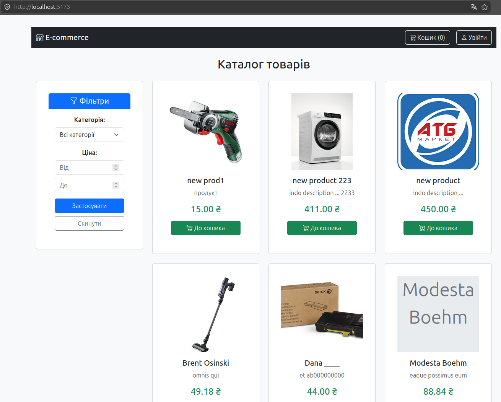
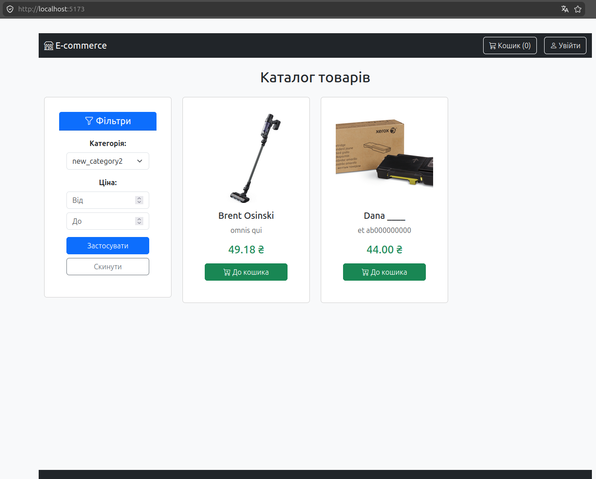
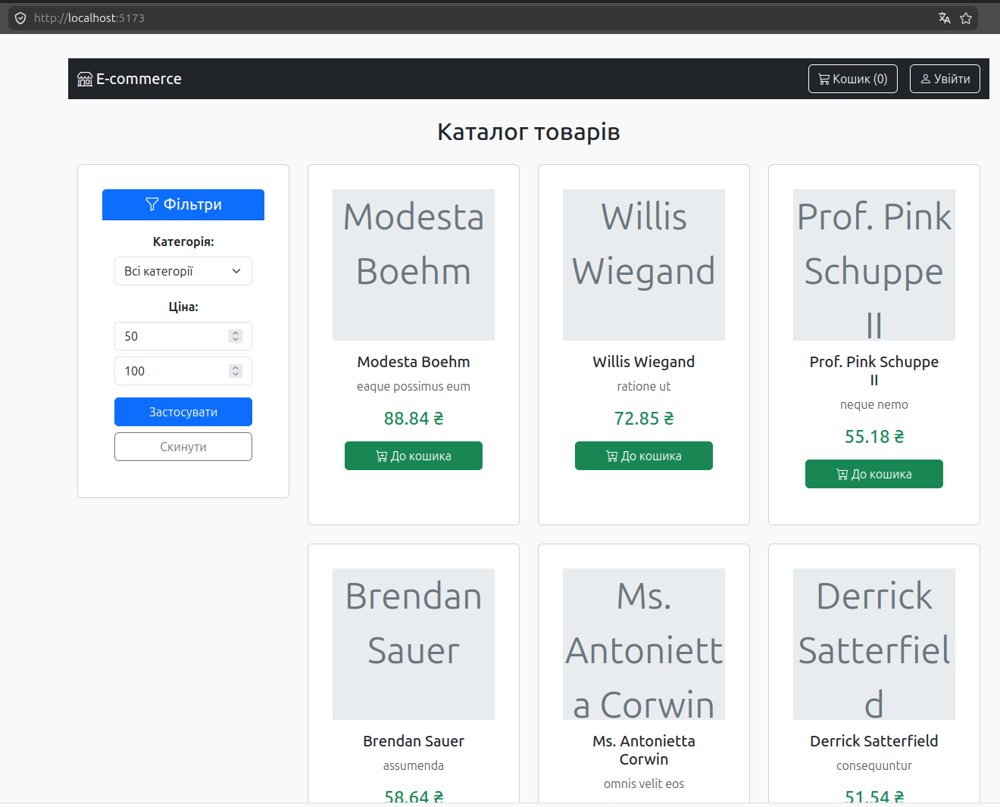

</details>

<details>
<summary>Cart and Checkout</summary>

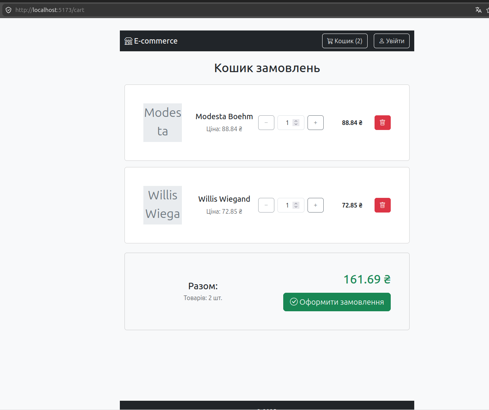
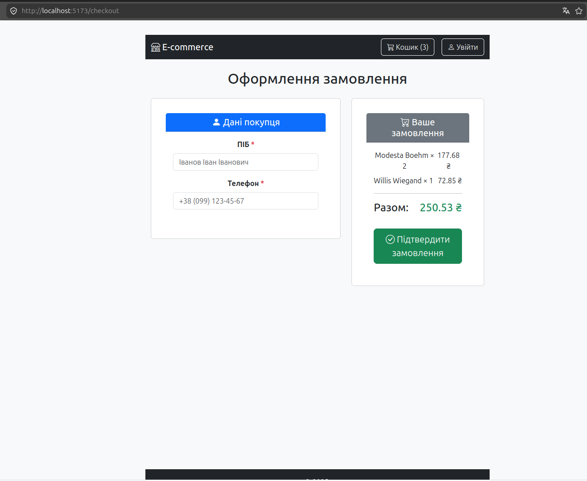

</details>

<details>
<summary>Authentication</summary>

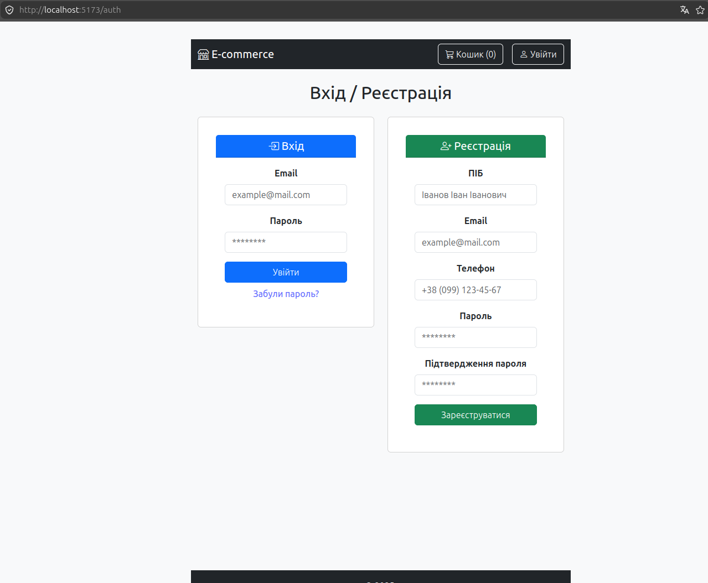

</details>

<details>
<summary>Admin Panel</summary>

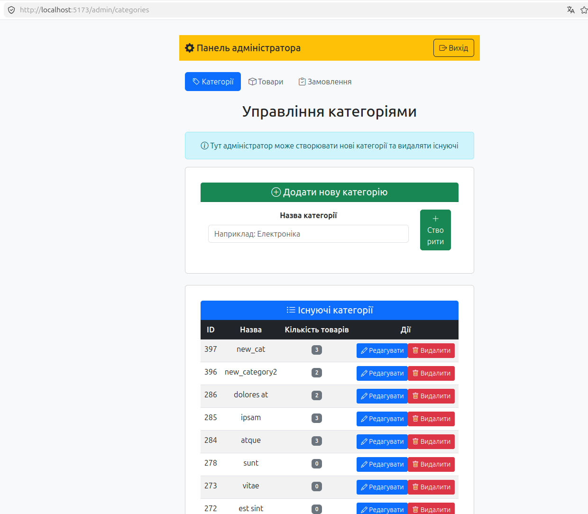
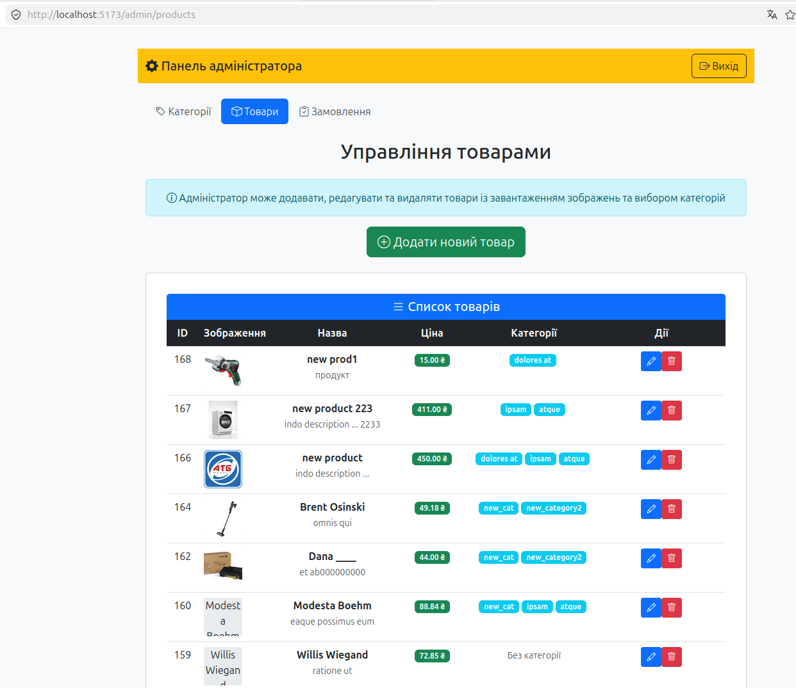
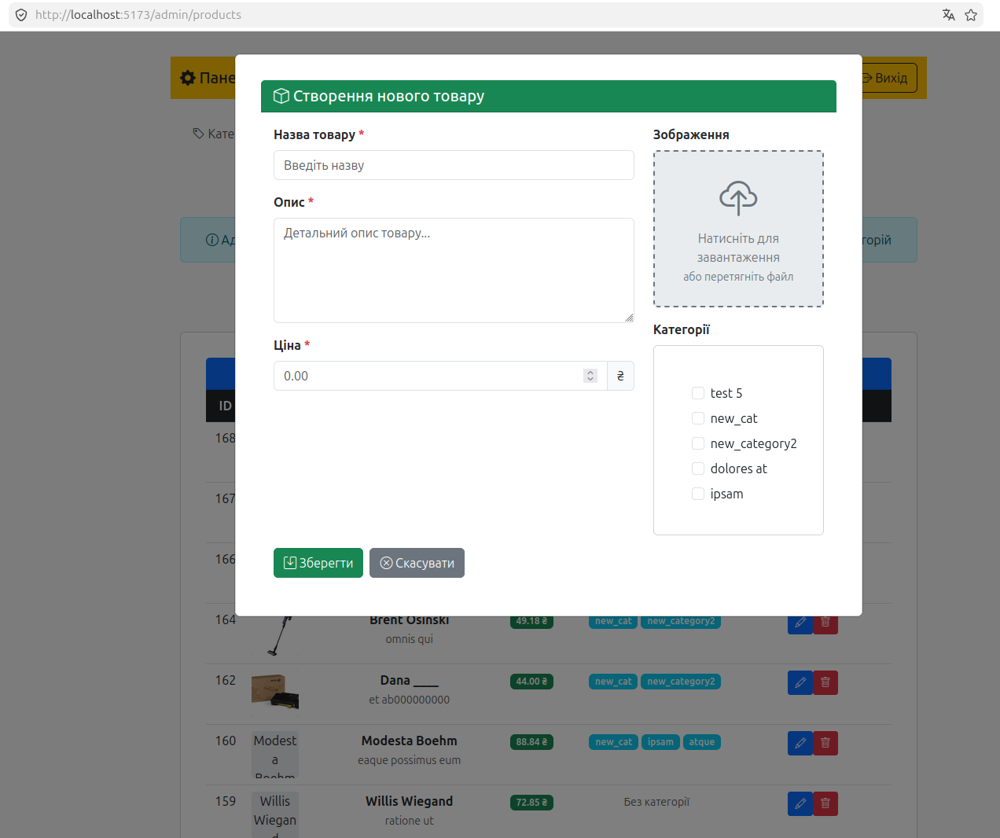
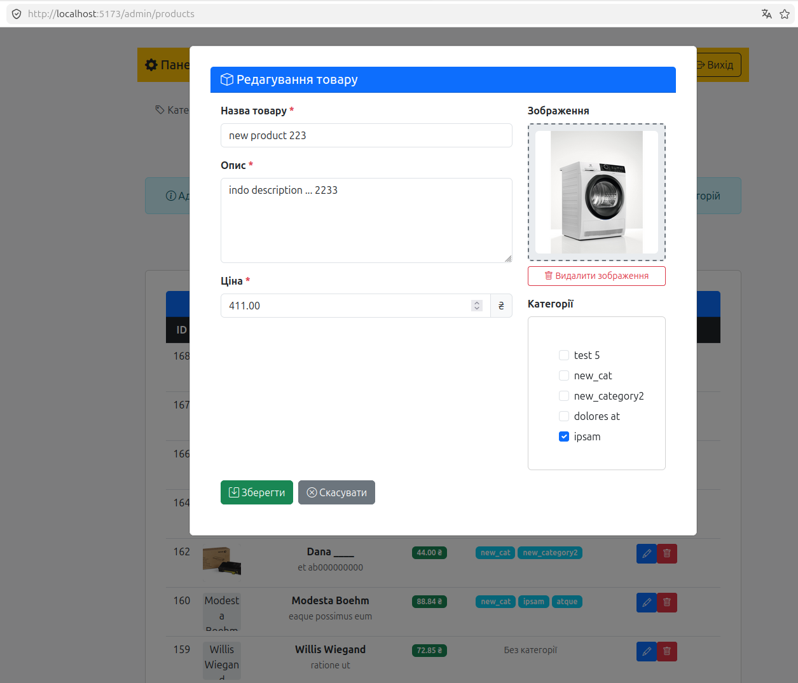
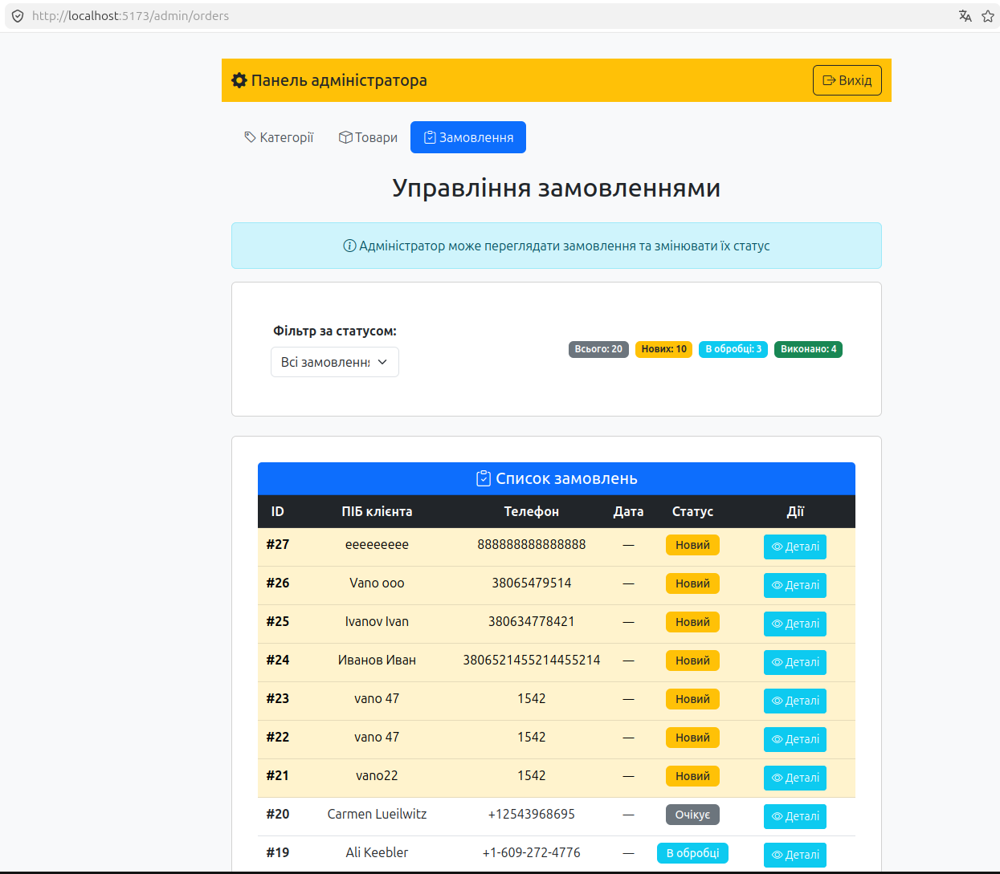

</details>
